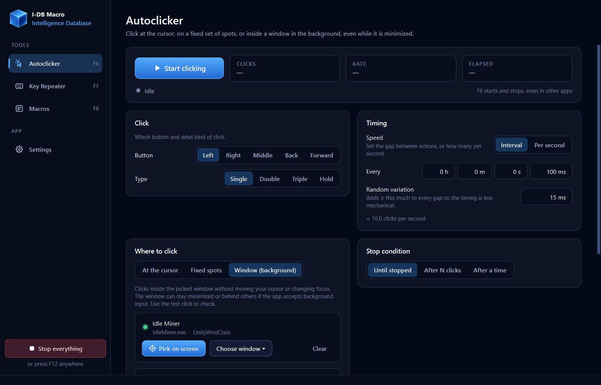
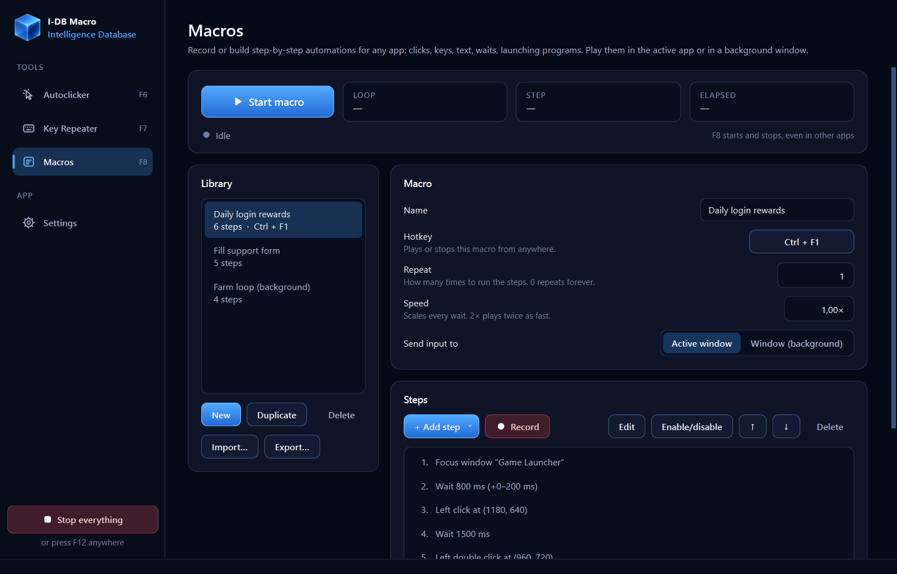
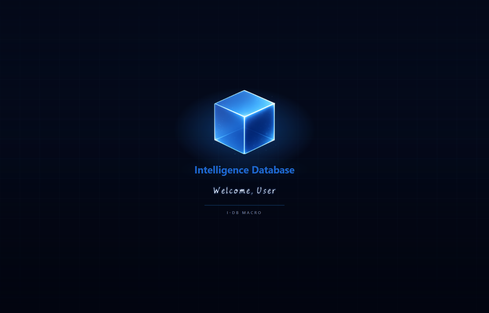

<div align="center">


# IDB-Macro

**Autoclicker, key repeater and macro recorder in one app, including in background windows.**

[](https://github.com/Enterlessguy/IDB-Macro/actions/workflows/ci.yml)


</div>

Most autoclickers and macro tools are either too simple, buggy, or full of
ads. IDB-Macro puts three tools in one clean app:

| | |
| --- | --- |
| **Autoclicker** | Click at the cursor, cycle through fixed spots, or click inside a window in the **background**, even while it is minimized. Any mouse button; single, double, triple or hold clicks; interval or clicks per second; random timing and position so it doesn't look robotic. |
| **Key Repeater** | The autoclicker idea for keyboards. Repeat a key or a combo like `Ctrl + S`, hold keys down, or cycle through several. It works in the active app or a background window, so you can keep typing elsewhere. |
| **Macros** | Record what you do, or build it step by step: clicks, drags, scrolling, keys, typed text, waits (with optional randomness), focusing a window, launching a program. Each macro can repeat, play faster or slower, and have its own hotkey. You can import and export macros to share them. |



### Saved setups

Save any Autoclicker or Key Repeater configuration as a named **setup**, and
switch between them from the bar at the top of each page. The bar shows when
you have unsaved changes. Each setup can have **its own hotkey**, which starts
and stops exactly that setup from anywhere. Setups can be exported and
imported as files.

Macros can run a saved setup as a step ("Run autoclicker profile" / "Run key
repeater profile"), either for a set time or until the setup's own stop
condition. For example: focus the game → run "Roblox fast click" for 30 s →
press E → run "Anti-AFK" until stopped. Exporting a macro bundles the setups it
uses, so the file works on someone else's PC too.

### Smart mode and dumb mode

- **Smart mode** (switch in the sidebar) adds one-click presets for common
  uses, such as *Roblox & games*, *Clicker games*, *Human-like*,
  *Background farming*, *Hold to walk* and *Anti-AFK*. It also shows live tips
  about your settings and turns on safety checks. Input only goes to the
  window you started in: if you Alt+Tab away, it pauses instead of clicking or
  typing into the other app, and it releases held keys. Clicks never land on
  the taskbar, the desktop or IDB-Macro itself.
- **Dumb mode** turns the whole app into one plain autoclicker: clicks per
  second, left or right button, and a Start button. Click "Back to the full
  app" to return. It has its own settings, so your full setups stay as they
  were.

## Background mode

Pick a window, and IDB-Macro sends clicks and keys **to that window only**.
Your cursor doesn't move, focus doesn't change, and the window can stay
minimized or behind other windows.

How it works on Windows: input goes to the exact control you picked, as window
messages. Many apps also check whether a mouse button or Ctrl is *really*
held down, and ignore input when it isn't. IDB-Macro briefly shares input
state with the target app's thread so the app sees the buttons and modifiers
it expects. That thread is the only thing affected; your own keyboard and
mouse are untouched. [docs/DESIGN.md](docs/DESIGN.md) has the full details.

> [!IMPORTANT]
> **No tool can make every app accept background input.** Most normal desktop
> apps work (Win32, WinForms, WPF, Qt, GTK, Tk, many launchers and idle
> games). Some things usually don't:
>
> - 3D games that read raw input or DirectInput
> - games with anti-cheat (don't use it there; you might get banned)
> - apps running as administrator, unless you run IDB-Macro as
>   administrator too
> - Chromium-based apps (Discord, browsers, Electron apps) while they are
>   **minimized**. They accept background input fine while they're open behind
>   other windows, so leave them open instead of minimizing them.
>
> Use the **test click** / **test press** buttons to check an app before you
> rely on it. If keys don't arrive, keep **Pretend the window is focused**
> turned on.

## Download

### Option 1: Download the app (recommended)

**[⬇ Download IDB-Macro for Windows](https://github.com/Enterlessguy/IDB-Macro/releases/latest/download/IDB-Macro-windows-x64.zip)**
(or see all [releases](https://github.com/Enterlessguy/IDB-Macro/releases)).

1. Unzip `IDB-Macro-windows-x64.zip` anywhere, for example your Documents
   folder.
2. Run `IDB-Macro\IDB-Macro.exe`. You don't need to install Python or
   anything else.
3. Later updates install from the app's **Updates** page.

Windows SmartScreen may warn about a new, unsigned app. Click *More info →
Run anyway*. Every release lists its SHA-256 checksum
(`IDB-Macro-windows-x64.zip.sha256`), so you can verify the download with
`Get-FileHash IDB-Macro-windows-x64.zip`.

### Option 2: Run from source (Windows and Linux)

You'll need Python 3.10 or newer.

```bash
git clone https://github.com/Enterlessguy/IDB-Macro.git
cd IDB-Macro
python -m venv .venv
# Windows: .venv\Scripts\activate    Linux: source .venv/bin/activate
python -m pip install .
idb-macro
```

You can also run `python -m idb_macro` from a checkout. Pass `--no-splash`
to skip the intro. To build the Windows app yourself, run
`python -m pip install ".[dev]"` and then `pyinstaller packaging/idb-macro.spec`;
the result lands in `dist/IDB-Macro/`.

### Linux notes

- Use an **X11** session. On Wayland, only apps running under XWayland can be
  controlled, because Wayland doesn't let one app send input to another.
- Background mode uses `XSendEvent`. Most GTK and Qt apps accept it, but a few
  programs ignore synthetic events on purpose (xterm does by default).
- Global hotkeys and recording need access to the X server, which is normal
  in a desktop session.

## Updates and explanations

- The **Updates** page shows the latest release from this repository and its
  notes. On the Windows app, *Download and install* fetches it, verifies its
  checksum and restarts into the new version.
- The 💡 buttons open a short animated explanation of the more advanced
  features: background clicking, key timing and hotkeys, macros, and smart
  mode. Each has a **Simple** and a **Technical** version of the text.

## Hotkeys

These work system-wide, even while another app has focus. You can change them
in Settings.

| Key | Action |
| --- | --- |
| `F6` | Start or stop the Autoclicker |
| `F7` | Start or stop the Key Repeater |
| `F8` | Play or stop the selected macro |
| `F9` | Start or stop recording a macro |
| `F12` | **Stop everything** and release held keys and buttons |

Each macro can also have its own hotkey. Moving the cursor into the top-left
screen corner stops foreground runs too (the fail-safe, which you can turn
off in Settings).

## Macros



- **Record:** click Record (or press F9), do the thing, then press F9 again.
  Waits between actions are kept. You can also record mouse movement, and
  merge typing into "Type text" steps (leave that off for games).
- **Edit:** double-click a step to edit it, drag to reorder, and right-click
  to duplicate or disable it.
- **Background macros:** set "Send input to" to a window, and clicks and keys
  go there instead. Positions are stored relative to that window, so it can
  move or be minimized.
- **Share:** use Export and Import. Imported files are validated, and if a
  file would start any programs you'll see exactly which ones before you
  accept.

## The startup animation



It's the same intro as the Intelligence Database Control Center. It fades in,
greets you by your account name, and fades into the app. You can turn it off
in Settings, or start with `--no-splash`.

## Privacy and security

- No telemetry or accounts. The only network use is checking GitHub for
  updates, and those downloads are checksum-verified.
- It never asks for admin or root rights.
- Settings and macros stay in your user folder (`%APPDATA%\IDB-Macro` or
  `~/.config/idb-macro`).
- Hotkeys and the recorder ignore software-generated input, so macros can't
  trigger themselves.

See [SECURITY.md](SECURITY.md) for details and how to report a problem.

## Use it responsibly

Automating input can break the terms of online games and services. You are
responsible for where you use it.

## Contributing

See [CONTRIBUTING.md](CONTRIBUTING.md). Reports like "background mode
works/doesn't work with app X" are especially useful.

## License

[MIT](LICENSE) © 2026 Intelligence Database. Third-party components keep their
own licences; see [THIRD_PARTY_NOTICES.md](THIRD_PARTY_NOTICES.md).
